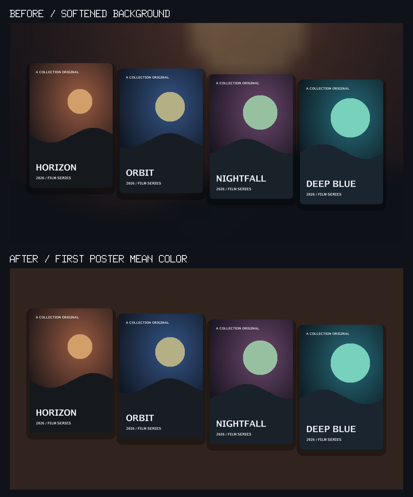
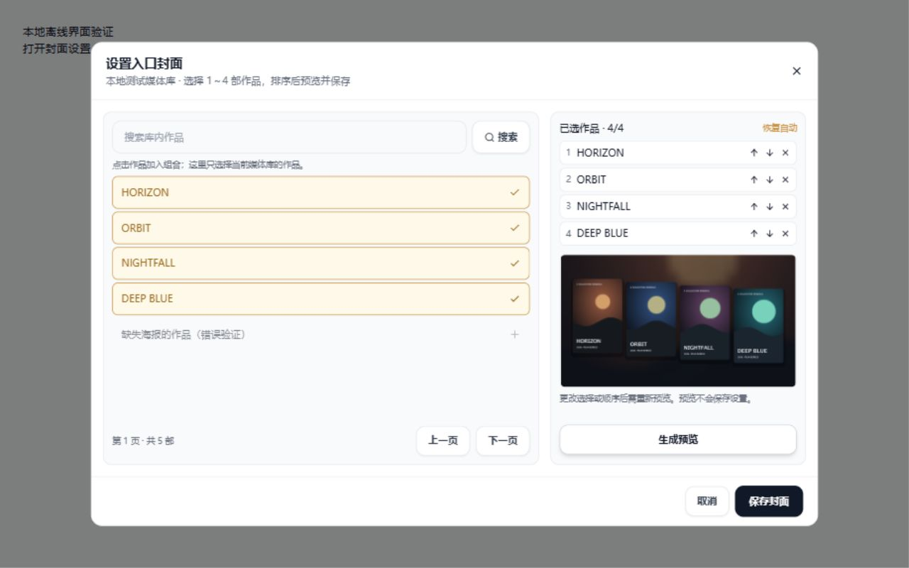
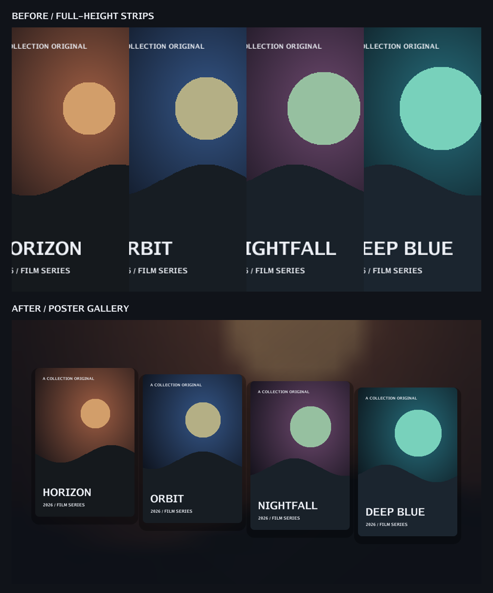

# 媒体库入口封面优化

核对日期：2026-10-06。参考项目：[g-steven037/emby-poster](https://github.com/g-steven037/emby-poster)，本次核对的 main 提交为 `982f9ef00684134c84af52a7b1317271e229b24b`。

## 调研结果

- [生成器源码](https://github.com/g-steven037/emby-poster/blob/982f9ef00684134c84af52a7b1317271e229b24b/generate_cover.py)通过 Emby API 取得最新电影与剧集素材，再用 Pillow 合成媒体库的横版主封面。它优化的是媒体库入口，不改变单部影视的海报。
- [配置](https://github.com/g-steven037/emby-poster/blob/982f9ef00684134c84af52a7b1317271e229b24b/config.py)提供两种 1920×1080 布局：六张海报横排加柔化背景，以及九张海报组成倾斜阶梯墙。中文名称与英文副标题需要额外字体和名称映射。
- 源码会静默忽略部分下载、解码、字体加载错误，素材不足时跳过生成；`UPDATE_INTERVAL_HOURS` 在生成器中没有调度实现。仓库在核对时未声明许可证。借鉴排版思路，独立实现，不复制其代码、字体、示例图片或容器。
- 生成器上传封面使用 `POST /emby/Items/{id}/Images/Primary`；当前 MediaStationGo 图片路由只有 GET/HEAD，不能直接接入它的上传步骤。现有按请求生成封面的链路可以复用，无需新增外部同步服务。

## 当前链路及改动

Emby 兼容端通过 `/Items/{library-id}/Images/Primary` 或 `/emby/Items/{library-id}/Images/Primary` 获取封面。`FolderCoverArtwork` 优先读取该库保存的作品组合；未设置时，从现有数据库自动选取最多四张素材。两种模式均沿用媒体库合并、剧集分组、图片去重与 ImageProxy 缓存。

此前，素材被裁切成铺满画布的等宽竖条；单图被横向展开，多图会裁掉海报侧边。本次按每张素材的原始比例等比缩放，居中排成轻微错落的画廊，加圆角和阴影。1～4 张素材都可正常呈现，不重复填充海报，不要求凑齐六张或九张。封面仍为 16:9，保持现有客户端的尺寸参数和 PNG 格式。

背景借鉴参考项目 Style 2 的自动取色思路：对排序第一张海报的整幅图像求 RGB 平均值，乘以 0.7 压暗，填充为纯色背景。透明像素按叠加在黑色上的颜色参与平均；不裁切取色、不叠加模糊或渐变，也不额外请求背景图。调换第一部作品会改变背景色，输出尺寸不会改变取色结果。只采用背景方案，保留现有的 1～4 张画廊排列和网页设置。

以下对比使用同一组离线示例海报和实际渲染代码：上方为此前柔化背景，下方为新的平均色背景。



封面缓存版本升级为 `folder-cover-gallery-solid-v8`，使旧柔化背景的缓存标识失效；素材 URL 继续纳入哈希，同一媒体更换海报 URL 时，媒体库封面的标识也会改变。现有的素材排序、单片图片标识和图片代理缓存策略保持原样。

Web 的入口缩略图改为请求 `/api/libraries/{id}/cover/image`，与设置页预览及 Emby 共用同一份素材选择和服务端画廊合成。名称与条目数继续显示在卡片中，无需另建名称映射或字体资源。

## 网页端设置

管理员进入「管理媒体库」，展开目标库的操作菜单，点击「设置入口封面」。可以搜索该库的作品，选择 1～4 部，上移、下移或移除作品，生成实际 PNG 预览后保存。更改选择或顺序会使旧预览失效，重新预览成功才能保存手动组合；预览不修改数据库。点击「恢复自动」并保存，可清空手动配置。

仅在现有 `libraries` 表新增 JSON 文本列 `cover_media_ids`，按顺序存储作品 ID，默认 `[]`；通过现有自动迁移升级，既有库继续使用自动模式。海报仍取自现有影视/剧集元数据，不复制素材或另建图片数据源。剧集选择代表媒体 ID，取图时解析为权威整剧海报，不能重复选择同一剧集或相同海报。

配置读取、保存和预览接口仅管理员可用；入口图片接口沿用播放权限和媒体库可见性限制。保存校验数量、重复、库归属和海报缺失；失效配置在设置页明确报错并允许重新选择或恢复自动。设置读取失败会禁用保存并提供重试。素材下载或解码失败时，预览返回错误，不生成少图封面或自动更换手动作品；Emby 图片链路记录失败原因。

弹窗支持深浅色和窄屏，候选作品及预览区域可滚动，保存栏保持可见。以下截图使用实际组件和本地离线测试数据，展示组合设置功能；截图中的背景为调整前样式，新背景见上方对比：



## 验证与边界

- 本地 Go 定向测试覆盖：图片接口、16:9 尺寸、空库 404/no-store、1～4 张素材的边缘保留、横版素材比例、稳定输出，以及更换海报 URL 后的缓存标识变化。
- 纯色背景测试覆盖：整幅双色海报平均色、非零图像坐标、首张海报顺序、不同输出尺寸，以及新样式与旧背景缓存标识的区别；现有预览与 Web、Emby 图片逐字节一致的测试继续通过。
- Web 执行 TypeScript/Vite 构建及改动文件的 ESLint 检查。
- 配置测试覆盖持久化顺序、恢复自动、已有库迁移、失效/跨库/重复作品、整剧海报与管理权限；预览与相同尺寸的 Web、Emby 已保存图片逐字节一致。
- 实际组件完成离线浏览器验证：选择、排序后旧预览失效、预览成功后保存、重新打开读取已存组合、素材失败禁止保存，以及 1280×800 桌面/375×812 窄屏和深浅色布局。
- 下图由实际新旧排版方式和离线绘制的示例海报生成，已作视觉核对；不是生产媒体库截图。
- 本次不调用 115/OpenList，不做真实云盘、电视设备或生产环境验证；不新增定时任务、上传接口，也不部署线上。

可复现的本地验证命令（均已通过）：

```powershell
go test ./internal/handler ./internal/service -count=1
git diff --check
# 在 web 目录中执行：
npm run build
npx eslint src/components/LibraryCoverDialog.tsx src/components/LibraryCoverImage.tsx src/pages/AdminLibraryPanel.tsx src/pages/AdminLibraryTable.tsx src/pages/LibrariesPageSections.tsx src/api/library.ts
```

Web 构建仍提示部分压缩后的 chunk 超过 500 kB；这是体积提示，不影响本次构建完成，本次不做无关的打包调整。


