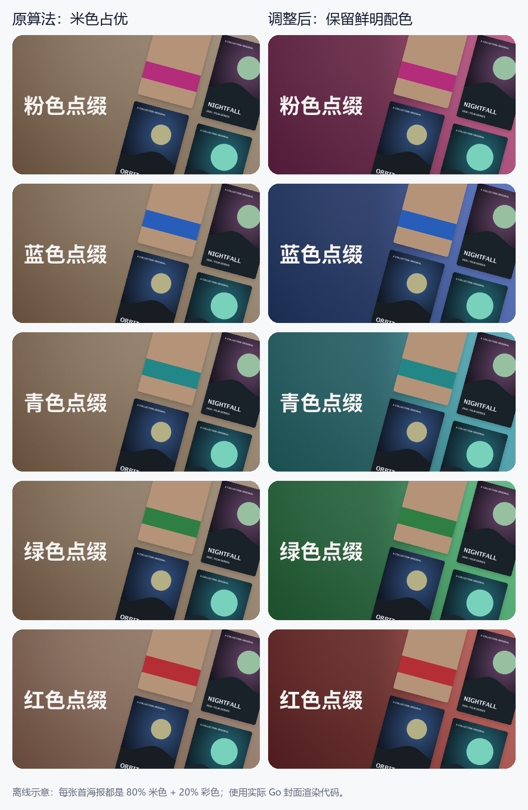
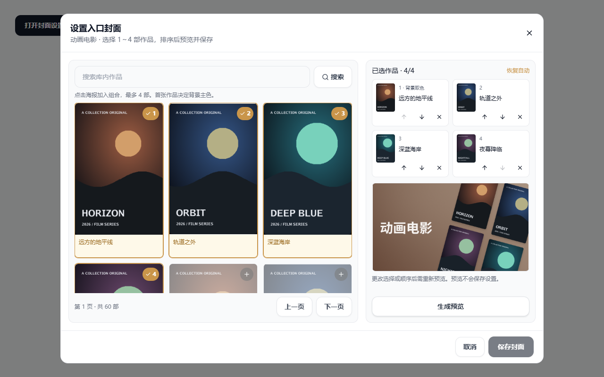

# 媒体库入口封面优化

实现更新日期：2026-10-07。参考项目：[g-steven037/emby-poster](https://github.com/g-steven037/emby-poster)，2026-10-06 调研核对的 main 提交为 `982f9ef00684134c84af52a7b1317271e229b24b`。

## 调研结果

- [生成器源码](https://github.com/g-steven037/emby-poster/blob/982f9ef00684134c84af52a7b1317271e229b24b/generate_cover.py)通过 Emby API 取得最新电影与剧集素材，再用 Pillow 合成媒体库的横版主封面。它优化的是媒体库入口，不改变单部影视的海报。
- [配置](https://github.com/g-steven037/emby-poster/blob/982f9ef00684134c84af52a7b1317271e229b24b/config.py)提供两种 1920×1080 布局：六张海报横排加柔化背景，以及九张海报组成倾斜阶梯墙。中文名称与英文副标题需要额外字体和名称映射。
- 源码会静默忽略部分下载、解码、字体加载错误，素材不足时跳过生成；`UPDATE_INTERVAL_HOURS` 在生成器中没有调度实现。仓库在核对时未声明许可证。借鉴排版思路，独立实现，不复制其代码、字体、示例图片或容器。
- 生成器上传封面使用 `POST /emby/Items/{id}/Images/Primary`；当前 MediaStationGo 图片路由只有 GET/HEAD，不能直接接入它的上传步骤。现有按请求生成封面的链路可以复用，无需新增外部同步服务。

## 当前链路及改动

Emby 兼容端通过 `/Items/{library-id}/Images/Primary` 或 `/emby/Items/{library-id}/Images/Primary` 获取封面。`FolderCoverArtwork` 优先读取该库保存的作品组合；未设置时，从现有数据库自动选取最多四张素材。两种模式均沿用媒体库合并、剧集分组、图片去重与 ImageProxy 缓存。

封面当前采用左侧库名、右侧倾斜 15° 海报墙的构图。每张素材按原始比例等比缩放，加小圆角和柔和阴影。1～4 张使用各自的排版，少量素材也不重复填充，不要求凑齐六张或九张；海报墙允许在画布边缘裁切，符合用户提供的入口卡片参考。封面仍为 16:9，保持现有客户端的尺寸参数和 PNG 格式。

背景采用宽范围柔和渐变和细微颗粒。根据 2026-10-07 截图中多张封面都接近棕灰色的问题，调整第一张海报的取色算法：整幅海报仍在固定 32×48 尺寸采样，色相分组由 12 组细化为 24 组；暗色、灰白和色彩跨度过小的像素不参与竞争。颜色权重改为饱和度的三次方乘亮度平方根，让有一定面积的鲜明颜色不会被大片米色或肤色盖住。候选色相及相邻区域须占全图至少 4%，避免零散高饱和像素或小标识主导整张背景。

选中区域的色相保持来自海报，输出饱和度由约 0.25～0.42 调整到约 0.40～0.62，亮部保留更多颜色。左侧叠加宽范围暗部，向右侧平滑消退，确保黄色和绿色背景下库名仍可读；右上柔光和稳定颗粒保持原有构图。无足够有色区域的灰度或全暗素材使用中性灰色；真正暖色的海报仍保持暖色。同色调海报仍可能产生相近背景，不按库名强行分配无关颜色。颗粒的幅度为每通道约 ±1.2，不使用随机数或时间种子，相同素材重复渲染保持逐字节一致。透明素材按黑底上的颜色参与取色，不额外请求背景图。

库名直接读取现有 `libraries.name`，采用随程序嵌入的 Noto Sans CJK SC Bold 字体，许可及来源见 [字体说明](../internal/handler/assets/fonts/README.md)。不依赖服务器安装字体，也不请求外部字体服务；长名称先缩小字号，再按两行排版，超长名称使用省略号。未收录的字形明确报错。

以下由调整前后的实际 Go 渲染代码生成。每张首海报都含 80% 相同米色和 20% 彩色区域，左侧为原算法、右侧为调整后；其余海报相同。这是离线示意，不是生产媒体库截图。



封面缓存版本升级为 `folder-cover-chromatic-wall-v10`，避免复用旧算法的成图和客户端缓存。库名和素材 URL 均纳入哈希，重命名媒体库或更换海报 URL 会改变封面的缓存标识。现有素材排序、单片图片标识和图片代理缓存策略保持原样。

Web 的入口缩略图请求 `/api/libraries/{id}/cover/image`，与设置页预览及 Emby 共用同一份素材选择和服务端合成。名称与条目数继续显示在卡片中，新增的图片内库名同样来自现有数据库，无需名称映射。

### 合成图片缓存

预览、Web 和 Emby 的最终 PNG 共用磁盘缓存，位于配置的缓存目录下 `images/variants/folder-covers`。第一次请求合成并原子写入；相同组合、顺序、库名、样式标识和实际输出尺寸直接读取成图，不再读取原图内容、解码海报或绘制背景。预览仍返回 `no-store`，Web 与 Emby 的现有 HTTP 缓存头保持不变；这里的 `no-store` 只限制客户端，不禁止服务器复用成图。保存只持久化作品 ID，因此预览成功后，同尺寸的已保存图片可以直接复用预览缓存。

缓存键同时包含原图文件或原图代理缓存的路径、大小和修改时间。同一海报地址对应的原图文件更新后重新生成；远程原图冷下载时，以下载完成后的文件版本写入，避免下一次请求再次合成。原图被缓存清理移除、成图超过 30 天或被容量清理后，下一次访问会重新生成。原图的远程刷新仍沿用现有 ImageProxy 规则，成图缓存不主动下载或轮询云盘。

成图与既有缩略图共用衍生图的 512 MiB 总预算、30 天过期清理及启动清理；单份 PNG 上限为 4 MiB，覆盖最大 1200×675 的输出。相同组合和尺寸的并发请求共享一次生成，不同组合可以独立生成；等待者取消不会中断已有生成。海报加载、缓存读取、PNG 头校验和写入失败均明确返回错误，不返回缺图封面或把未成功缓存的结果当作成功。缓存不是新的媒体来源，不新增表、定时任务或上传接口。

## 网页端设置

管理员进入「管理媒体库」，展开目标库的操作菜单，点击「设置入口封面」。左侧以海报卡片展示该库的候选作品，保留标题，选中后显示顺序编号。右侧已选区显示海报缩略图、标题及上移、下移和移除按钮；第一个位置明确标注「背景取色」。可以搜索该库的作品，选择 1～4 部，生成实际 PNG 预览后保存。更改选择或顺序会使旧预览失效，重新预览成功才能保存手动组合；预览不修改数据库。点击「恢复自动」并保存，可清空手动配置。

候选网格采用紧凑卡片：宽屏桌面 5 列、手机 3 列，缩小卡片间距和选中编号，并使用单行标题；长标题保留完整按钮名称和悬停提示。手机候选区的滚动高度增至 384 px。按实际组件测量，1280×800 的桌面首屏完整可见作品由 3 部增至 10 部，375×812 的手机由 2 部增至 6 部。最多选择四部和每页 48 部的原有规则保持不变。

候选接口 `/api/libraries/{id}/cover/candidates` 仅管理员可用，复用现有 `BrowseLibrary` 的搜索、分页、合并库和作品分组，再对当前页执行共用的海报解析，不新增媒体来源或扫描。候选卡片、已保存组合及合成图片共同使用现有电影/整剧元数据；剧集卡片显示整剧海报，避免与最终合成的素材不一致。读取已保存组合同时返回海报 URL 和更新时间，重新打开设置时仍可见缩略图。无海报作品明确标注且禁用选择；图片加载失败明确展示错误，不偷偷替换背景图。浏览器通过既有 ImageProxy 请求缩略图，并使用懒加载。

仅在现有 `libraries` 表新增 JSON 文本列 `cover_media_ids`，按顺序存储作品 ID，默认 `[]`；通过现有自动迁移升级，既有库继续使用自动模式。海报仍取自现有影视/剧集元数据，不复制素材或另建图片数据源。剧集选择代表媒体 ID，取图时解析为权威整剧海报，不能重复选择同一剧集或相同海报。

配置读取、保存和预览接口仅管理员可用；入口图片接口沿用播放权限和媒体库可见性限制。保存校验数量、重复、库归属和海报缺失；失效配置在设置页明确报错并允许重新选择或恢复自动。设置读取失败会禁用保存并提供重试。素材下载或解码失败时，预览返回错误，不生成少图封面或自动更换手动作品；Emby 图片链路记录失败原因。

弹窗支持深浅色和窄屏，候选海报及预览区域可滚动，保存栏保持可见。以下截图使用实际组件和本地离线测试数据，展示当前海报选择、排序及组合预览；不是生产媒体库截图：



[窄屏海报选择界面](assets/library-cover-poster-settings-mobile.png)

## 验证与边界

- 本地完整 handler/service 测试通过，覆盖：图片接口、16:9 尺寸、空库 404/no-store、1～4 张所选素材均可见且只分配一个位置、横版素材比例、稳定输出，以及更换海报 URL 后的缓存标识变化。
- 背景测试覆盖：整幅双色素材和非零图像坐标、米色占 80% 时仍保留粉/蓝/青/绿/红色区域、真正暖色与黑白素材、忽略小面积高饱和标识、左深右亮、全画布不透明、颗粒稳定，以及更换首张素材后背景改变。六种色相及灰色背景的标题区域白字对比度均不低于 4.5:1；预览与 Web、Emby 图片逐字节一致的测试继续通过。
- 库名测试覆盖简繁中文、拉丁文字、长名称、缺失字形，以及重命名后图片与 ETag 更新且三种图片接口仍输出相同内容。
- Web 执行 TypeScript/Vite 构建及改动文件的 ESLint 检查。
- 配置测试覆盖持久化顺序、恢复自动、已有库迁移、失效/跨库/重复作品、整剧海报与管理权限；预览与相同尺寸的 Web、Emby 已保存图片逐字节一致。
- 候选接口测试覆盖管理员权限、分页校验、搜索空结果及明确标记无海报作品；服务测试验证候选与已选卡片使用相同的整剧海报，且顺序及海报更新时间正确返回。
- 实际组件完成离线浏览器验证：海报可见、最多选四部、无海报不可选、跨页保留选择、排序后旧预览失效、预览成功后保存、重新打开恢复缩略图及排序、素材失败禁止保存，以及 1280×800 桌面/375×812 窄屏和深浅色布局。
- 紧凑网格额外核对 320、640、768、900 px 宽度，候选区均无横向溢出；四部限制、选中编号、移除后预览失效与深色主题仍正常。
- 成图缓存测试覆盖重复访问、重启后复用、原图在相同 URL 更新、库名/作品顺序/素材 URL/尺寸变化、过期、远程原图首次下载、17 个并发请求、等待者取消，以及生成/缓存故障不产生伪成功。HTTP 测试检查预览、Web、Emby 读取同一份成图且不重写文件；完整 handler/service 测试通过。本机 `CGO_ENABLED=0`，未能运行 `-race`。
- Windows/amd64、i5-12600KF 上的本地渲染函数基准：四张离线海报、360×203 输出，冷合成约 34.66 ms/次，读取成图缓存约 0.283 ms/次；内存分配分别约 5.21 MB 与 0.224 MB/次。这是本地函数测量，线上接口耗时需要发布后另行验证。
- 1～4 张、冷暖配色和长名称均使用实际渲染代码作视觉核对；不是生产媒体库截图。
- 本次取色改动使用离线素材，仅做本地验证，不调用 115/OpenList；尚未发布新镜像，也未做真实云盘、电视设备或生产环境验证。

可复现的本地验证命令（均已通过）：

```powershell
go test ./internal/handler ./internal/service -count=1
go test ./internal/handler -run '^$' -bench '^BenchmarkLibraryCoverRendering$' -benchmem -benchtime=500ms -count=1
git diff --check
# 在 web 目录中执行：
npm run build
npx eslint src/components/LibraryCoverDialog.tsx src/components/LibraryCoverImage.tsx src/pages/AdminLibraryPanel.tsx src/pages/AdminLibraryTable.tsx src/pages/LibrariesPageSections.tsx src/api/library.ts
```

Web 构建仍提示部分压缩后的 chunk 超过 500 kB；这是体积提示，不影响本次构建完成，本次不做无关的打包调整。

历史效果保留供追溯：[初版竖条与画廊排版对比](assets/library-cover-preview.png)、[柔化背景与纯色背景对比](assets/library-cover-solid-preview.png)、[v9 背景取色示意](assets/library-cover-textured-wall-preview.png)、[初版标题列表选择界面](assets/library-cover-settings.jpg)。
